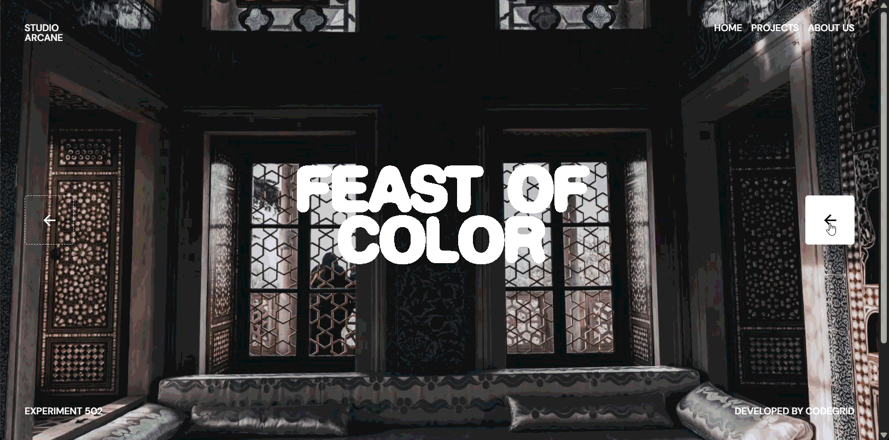

# Gooey Text Reveal Carousel

This microproject is a carousel with a gooey text reveal effect, designed to feel playful, cinematic, and tactile. It uses layered motion, soft blur, and fluid transitions to create a polished reveal for a modern landing page or brand showcase using Vite, GSAP, and Lenis.

## Preview



## Run locally

1. Install dependencies:
   ```bash
   npm install
   ```
2. Start the development server:
   ```bash
   npm run dev
   ```
3. Open the local URL shown in the terminal (usually http://localhost:5173).

## Build for production

```bash
npm run build
```
